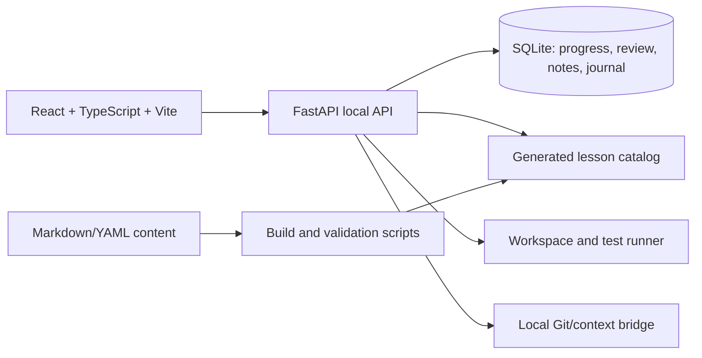

# Journey AI Engineer

> A local-first, bilingual learning platform that turns an AI Engineer roadmap into verified lessons, VS Code labs, spaced review, journal entries and Git-ready project evidence.

Journey AI Engineer là một **learning product local-first** dành cho sinh viên muốn đi từ nền tảng lập trình đến khả năng xây, đánh giá và vận hành hệ thống AI/GenAI. App không chỉ là bảng checklist: mỗi lesson có giải thích trong app, ví dụ, practice, tiêu chí hoàn thành, tài liệu đọc sâu và review card.

Mục tiêu của v0.1:

- học Python/software engineering, toán–thống kê, classical ML, deep learning, MLOps và LLM/RAG theo dependency rõ;
- làm bài trong workspace mở bằng VS Code và chạy test có manifest;
- lưu evidence, journal, review history và context để hỏi ChatGPT/Codex mà vẫn tự làm chủ code;
- tạo project artifact có README, evaluation, architecture decision và lessons learned;
- clone/fork repository để học và đóng góp bằng pull request.

> **Phạm vi cần hiểu rõ:** v0.1 chạy local cho một người dùng trên Windows. Chưa có đăng nhập, đồng bộ tiến độ, Postgres/RLS, API AI trả phí hay public multi-user hosting. Không expose FastAPI local ra Internet.

## Sản phẩm này là gì?

Journey AI Engineer biến một roadmap học AI Engineer dài hạn thành một **learning product có workflow thực thi được**. Người học không chỉ đọc danh sách chủ đề; họ đi qua một vòng lặp có thể kiểm chứng:

```text
Roadmap → Lesson → Practice Lab → Test → Review → Journal → Git artifact
```

Mỗi lesson giải thích khái niệm bằng tiếng Việt và thuật ngữ tiếng Anh, có ví dụ, bài thực hành, edge case, tiêu chí hoàn thành, câu hỏi review và tài liệu đọc sâu. Workspace tương ứng được tạo trong máy local để người học mở bằng VS Code, viết code, chạy test và lưu bằng chứng trước khi đánh dấu hoàn thành.

Sản phẩm được thiết kế cho hai nhu cầu liên quan nhưng tách biệt:

- **Học có hệ thống:** curriculum có prerequisite graph, track Standard/Accelerated, review queue và journal.
- **Xây artifact thật:** exercise có test contract, project có README/evaluation/architecture decision, Git flow có diff review và secret redaction.

## Giá trị kỹ thuật chính

- **Content as source code:** lesson được viết bằng Markdown/YAML, build thành catalog JSON và được validator kiểm tra link, prerequisite, resource, exercise và review card.
- **Local-first learning data:** tiến trình, notes, journal và review state nằm trong SQLite local; không cần tài khoản, API key hoặc cloud service để bắt đầu.
- **Practice ngoài notebook:** workspace có starter, README, expected evidence và test manifest; bài làm được chạy bằng command allowlist với timeout và output cap.
- **GitHub-ready workflow:** app đọc status/diff, gợi ý commit message, export journal/context và chỉ publish artifact sau khi người học xem diff và xác nhận.
- **Release có thể lặp lại:** source clone dành cho phát triển; portable `.exe` dành cho học local; release ZIP có version và SHA-256 checksum.
- **Ranh giới bảo mật rõ ràng:** API chỉ bind loopback, route filesystem/Git/subprocess có allowlist, secret redaction và không được dùng như public code-execution endpoint.

## Kiến trúc ở mức cao



Frontend chỉ gọi API local qua loopback. Nội dung curriculum là source có thể review trong Git; database runtime và journal cá nhân nằm ngoài source tree được commit. Thiết kế này giúp người khác fork repository để sửa lesson hoặc project mà không phải mang theo dữ liệu cá nhân của maintainer.

## Chọn cách dùng

| Mục đích | Cách dùng | Dữ liệu |
| --- | --- | --- |
| Học, sửa lesson, làm bài và push artifact lên GitHub | **Source clone** | .data/ trong clone; chỉ commit content/evidence đã review |
| Học local bằng double-click, không cần Git | **Portable .exe** | %LOCALAPPDATA%/JourneyAIEngineer; không tự publish |
| Muốn public web cho nhiều tài khoản | Chưa hỗ trợ trong v0.1 | Cần auth, Postgres/RLS, rate limit và tách local capabilities |

## Chạy nhanh trên Windows

Yêu cầu: Windows 10/11, Python 3.11+, Node.js 20+, Git và VS Code. Docker không bắt buộc cho local v0.1.

~~~powershell
git clone https://github.com/Hzyl/JourneyAIEngineer.git
Set-Location JourneyAIEngineer
.\scripts\setup.ps1
.\scripts\dev.ps1
~~~

Mở http://127.0.0.1:5173. Nếu muốn chạy thủ công:

~~~powershell
python -m uvicorn apps.api.main:app --reload --host 127.0.0.1 --port 8000
npm run dev
~~~

Setup tạo .venv, cài dependency backend/frontend theo lockfile, tạo .data/ và khởi tạo database. Không commit .data, .env, .venv, database hoặc journal riêng.

## Portable .exe

Maintainer tạo bản phát hành bằng:

~~~powershell
npm run package:windows
~~~

Script chạy quality gates, build frontend, đóng gói JourneyAIEngineer.exe, tạo ZIP versioned và SHA256SUMS.txt. Người dùng tải ZIP từ GitHub Release, giải nén vào thư mục có quyền ghi và double-click executable. SmartScreen có thể cảnh báo vì binary chưa được code-sign; checksum giúp kiểm tra toàn vẹn nhưng không thay thế code signing.

Portable mode tự mở browser ở loopback, không hiện terminal và tự tắt nền sau khi tab cuối cùng rời đi. Data root mặc định là %LOCALAPPDATA%\JourneyAIEngineer; có thể đổi bằng:

~~~powershell
$env:JOURNEY_DATA_DIR = "$env:USERPROFILE\JourneyAIEngineerData"
.\JourneyAIEngineer.exe
~~~

Muốn export artifact/Git từ bản portable, trỏ JOURNEY_PROJECT_ROOT tới source clone trước khi mở app:

~~~powershell
$env:JOURNEY_PROJECT_ROOT = "C:\src\JourneyAIEngineer"
~~~

Không có clone thì UI phải hiển thị local learning mode và tắt publish GitHub. Bản portable không chứa database runtime của maintainer.

## Một vòng học có thể lặp lại

1. Vào Roadmap, đọc mục tiêu, concept notes, formula/code example và completion criteria.
2. Mở Practice Lab, tạo workspace cho exercise rồi mở đúng thư mục bằng VS Code.
3. Tự làm trước, ghi input/output và giả thuyết khi có lỗi; chạy test theo manifest.
4. Đánh dấu lesson sau khi có evidence, trả lời review card (again, hard, good, easy).
5. Ghi một insight vào Journal. Khi bị kẹt, tạo context export có lesson/progress/note rồi dán sang ChatGPT/Codex.
6. Review Git diff, redact secret và chỉ export hoặc push artifact được allowlist.

App không tự gọi API AI và không cần API key ở MVP. Context bridge là file/clipboard Markdown, để người học giữ quyền kiểm soát dữ liệu và chi phí.

## Curriculum

Catalog hiện có **23 phase và 208 lesson**:

- 8 phase core: onboarding, Python/software engineering, math for ML, classical ML, deep learning, MLOps/deployment, NLP/LLM/RAG và capstone/career.
- 15 phase GenAI specialization: GenAI software foundations, ML/embedding, Transformer, LLM application engineering, RAG, advanced RAG, tool calling, agents, MCP, evaluation, observability, production engineering, fine-tuning, local LLM và AI system design.

Thứ tự được kiểm tra bằng prerequisite graph: software engineering → math/statistics → classical ML → deep learning → Transformer/LLM → application/RAG → tools/agents → evaluation/observability → production hardening → specialization/system design. Mỗi lesson có Việt/English, objective, prerequisite, concept notes, walkthrough, practice, resource guidance, checklist, common mistakes, next lesson và review cards.

Hai nhịp học được seed thật:

- **Standard:** khoảng 12–15 tháng, 12–15 giờ/tuần.
- **Accelerated:** map lesson/project cụ thể để tạo evidence sớm; không chỉ đổi tiêu đề tuần.

Lesson source ở content/lessons/*.md; JSON generated ở content/lessons.json để app chạy ngay sau fresh clone. Resource library có tài liệu official-first (Python, NumPy, scikit-learn, PyTorch, FastAPI, Docker, MLflow, Hugging Face, Google ML, Stanford CS229, D2L, Full Stack Deep Learning) và nguồn community được gắn nhãn. Ví dụ [AI Engineering from Scratch](https://github.com/rohitg00/ai-engineering-from-scratch) là tài liệu đọc thêm, không thay thế phần giải thích trong app.

## Các project showcase

Roadmap tăng dần qua:

1. **LLM Chat API** — request/response, structured output, streaming, retry và cost.
2. **Document Intelligence System** — parsing, chunking, metadata, extraction và evaluation.
3. **Advanced RAG System** — hybrid search, BM25/vector, reranking, citation và error analysis.
4. **AI Assistant với Database & API** — tool schema, validation, timeout, auth boundary.
5. **Research Assistant Agent** — planning, memory, tool use, guardrails và human-in-the-loop.
6. **End-to-End Production GenAI System** — architecture, observability, latency/cost, deployment và rollback.

Mỗi project cần README, problem statement, baseline, metric, test, evaluation report, architecture decision và demo evidence. Khả năng clone/chạy, chất lượng evidence và cách giải thích trade-off là tiêu chuẩn chính để người khác đánh giá project.

## Workspace, test và GitHub journey

Mỗi exercise tạo .data/workspaces/<exercise-slug> với starter, test contract, README mục tiêu/input/output/edge case và expected evidence. Test runner chỉ chạy command được manifest cho phép với timeout/output cap. Nút Tạo & mở VS Code trỏ thẳng tới workspace, nên bạn có thể sửa và lưu bằng Ctrl+S.

Khi hoàn thành:

1. Chọn Lưu artifact để copy file an toàn sang exercises/, projects/ hoặc journal/.
2. App bỏ qua .env, .db, .venv, symlink và pattern secret; vẫn phải xem diff bằng mắt.
3. Trong Journal & Git, kiểm tra diff và commit message gợi ý.
4. Tick xác nhận rồi mới publish. Push thất bại vẫn giữ commit local để xử lý credential/remote.

Remote repository dùng đúng tên Hzyl/JourneyAIEngineer. Nếu bạn fork, hãy thay remote theo tài khoản của bạn. App không lưu credential và không tự push khi chưa có xác nhận.

## Feedback, cộng đồng và cập nhật lesson

Lesson có panel Giúp bài học tốt hơn cho lỗi nội dung, thiếu ví dụ/resource, broken link, exercise problem hoặc feature request. Local beta lưu feedback pending trong SQLite; community chỉ đọc feedback accepted/implemented. Email, progress và journal riêng không đi vào public payload. App không tự sửa hoặc push curriculum; maintainer review rồi cập nhật Markdown qua Git.

Feedback online/public trong tương lai cần auth, moderation, rate limit, abuse control và Postgres/RLS. SQLite local không phải backend multi-tenant.

## Security boundary và RedAmon

scripts/security_audit.py --format summary là passive inventory: đọc route/schema/source pattern, không gửi network request, không gọi handler, không tạo payload và không clone/cài/chạy [RedAmon](https://github.com/samugit83/redamon). RedAmon chỉ là security lab tham khảo cho target do bạn sở hữu/được ủy quyền, trong staging cô lập và dữ liệu giả. Không quét production/public target hay hệ thống người khác.

Local routes có path allowlist, timeout, output cap, origin/loopback guard và secret redaction. Không bind 0.0.0.0, forward port hoặc đặt admin token trong frontend. Xem [SECURITY.md](SECURITY.md) để biết boundary và cách báo cáo.

## Quality gates cho contributor

~~~powershell
python scripts/build_lesson_catalog.py
python scripts/validate_content.py
python -m pytest -q --basetemp .build\pytest -o cache_dir=.build\pytest-cache
npm ci
npm run lint
npm run build
~~~

Hoặc chạy .\scripts\test.ps1 để dùng bộ kiểm tra chuẩn. CI trên GitHub chạy content validation, Python tests, pip check, npm lockfile install, lint và Vite build. Release script kiểm tra ZIP không chứa .data, database, .venv, node_modules, .env, secret hoặc cache.

Xem:

- [Windows quickstart](docs/QUICKSTART-WINDOWS.md)
- [Architecture](docs/ARCHITECTURE.md)
- [Contributing](CONTRIBUTING.md)
- [Security policy](SECURITY.md)
- [Content source](content/lessons/)
- [Study playbook](content/study-playbook.md)

## Phát hành local và GitHub

~~~powershell
npm run package:windows
~~~

Output ở .build/releases/: executable copy, ZIP versioned và checksum. Chỉ maintainer tạo GitHub Release sau khi xem diff, secret/history scan và xác nhận thủ công. JourneyAIEngineer.exe và runtime state đã được ignore, nên không đưa executable/database cá nhân vào source PR.

## Evidence và demo

Mỗi project trong roadmap được xem là hoàn chỉnh khi có README, problem statement, baseline, metric, test, evaluation report, architecture decision, lessons learned và demo evidence. Các artifact này giúp người dùng khác có thể kiểm tra kết quả, tái chạy workflow và hiểu rõ trade-off kỹ thuật.

Repository giữ phạm vi và giới hạn của v0.1 minh bạch: đây là learning product local-first single-user, không phải hosted SaaS hay hệ thống AI production multi-user. Những capability chưa có auth, cloud isolation hoặc monitoring thật không được mô tả vượt quá phạm vi đó.

## Roadmap

- **v0.1:** local-first single-user, bilingual curriculum, review, workspace, journal, Git context bridge, source clone và portable Windows package.
- **v0.2:** public read-only learning hub/feedback moderation sau khi chốt auth/data isolation.
- **v0.3:** optional hosted progress sync, account recovery và provider adapters; local export/import vẫn là đường lui.

Apache-2.0 được dùng cho source code repository. Tài liệu, model, dataset và code bên thứ ba giữ license riêng; hãy xem attribution trước khi tái sử dụng.
