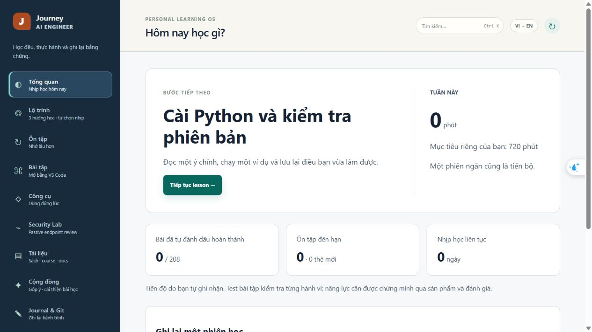

# Journey AI Engineer

> **Local-first learning product cho AI Engineer** — học theo roadmap, làm bài trong VS Code, ôn tập có lịch, lưu journal và tạo project evidence có thể review.

Journey AI Engineer biến việc học AI Engineer thành một vòng lặp có thể kiểm chứng:

~~~text
Roadmap → Lesson → Practice Lab → Test → Review → Journal → Git evidence
~~~

Mục tiêu của sản phẩm là giúp người học đi từ Python/software engineering đến machine learning, deep learning, LLM/RAG, evaluation, observability và system design. Nội dung giải thích chính nằm trong app bằng tiếng Việt, thuật ngữ giữ bằng English và có resource chính thức để đọc sâu.

> **Windows portable: v0.1.2. Web beta: đã triển khai.**
> Bản Windows chạy local-first, single-user; web beta chạy trên Cloudflare Pages với Supabase Auth/Postgres/RLS.
> Web hỗ trợ đăng nhập email/password và lưu dữ liệu học theo tài khoản, không có quyền dùng công cụ local.
> Xem [trạng thái web beta và cập nhật auth](docs/WEB-BETA.md). Đừng expose API local ra Internet.

---

## Thử một vòng học

Chọn hướng học → đọc một bài → tự làm bài tập → xem kết quả → ghi lại điều còn vướng.

**Ảnh và các thay đổi dưới đây thuộc bản đang phát triển, chưa phải bản đã deploy.**
Bản mới có trang xem thử không cần tài khoản, ba hướng học và 10 bài onboarding đã biên tập
song ngữ; 198 bài còn lại được gắn nhãn nháp. Hoàn thành bài đọc không đồng nghĩa thành thạo.
Xem [tiến độ kiểm chứng](docs/PUBLIC-READINESS-IMPLEMENTATION.md).

Thử ngay ví dụ chạy không cần Git hay API key: [trợ lý tài liệu tiếng Việt](samples/vi-document-assistant/README.md).
Đây là baseline tìm kiếm và trích dẫn, chưa dùng LLM; có bộ câu hỏi nhỏ để kiểm tra cách hoạt động.

## Chọn cách dùng

### Cách 1 — Portable .exe: dành cho người muốn tải về và học ngay

Mở app, đọc bài và ôn tập không cần Python/Node/Git. Để chạy bài tập Python, cần cài Python 3.11+ riêng; VS Code là tùy chọn.

1. Mở [GitHub Releases](https://github.com/Hzyl/JourneyAIEngineer/releases/latest).
2. Tải **JourneyAIEngineer-v0.1.2-windows-x64.zip** và **SHA256SUMS.txt** trong cùng release.
3. Kiểm tra checksum theo hướng dẫn bên dưới.
4. Giải nén ZIP vào một thư mục riêng, ví dụ `C:\Users\<you>\Documents\JourneyAIEngineer`.
5. Mở thư mục vừa giải nén và double-click **JourneyAIEngineer.exe**.

App sẽ tự khởi động server chỉ trên máy bạn, mở trình duyệt và không mở cửa sổ terminal. Khi tab cuối cùng đóng, server local sẽ tự dừng sau một khoảng ngắn.

Nếu Windows SmartScreen cảnh báo, hãy kiểm tra đúng nguồn tải và checksum. Binary beta chưa được code-sign nên cảnh báo này có thể xuất hiện.

### Kiểm tra SHA-256 trên PowerShell

Chạy trong thư mục chứa ZIP và SHA256SUMS.txt:

~~~powershell
$zip = '.\JourneyAIEngineer-v0.1.2-windows-x64.zip'
$expected = ((Get-Content '.\SHA256SUMS.txt' -Raw).Trim() -split '\s+')[0].ToLowerInvariant()
$actual = (Get-FileHash $zip -Algorithm SHA256).Hash.ToLowerInvariant()

if ($actual -ne $expected) {
  throw 'Checksum không khớp. Xóa ZIP và tải lại từ GitHub Release.'
}

'Checksum OK: ' + $actual
~~~

Portable app lưu tiến trình ở:

~~~text
%LOCALAPPDATA%\JourneyAIEngineer
~~~

Nơi này chứa database, review state, notes, journal và workspace local của **riêng người đang dùng máy**. Nó không được commit lên GitHub và không tự publish artifact.

Có thể đổi data root trước khi mở app:

~~~powershell
$env:JOURNEY_DATA_DIR = "$env:USERPROFILE\JourneyAIEngineerData"
.\JourneyAIEngineer.exe
~~~

### Cách 2 — Source clone: dành cho học viên muốn sửa code và push artifact

Dùng source nếu muốn sửa chính ứng dụng. Làm bài tập trong VS Code cũng được trên portable khi đã cài Python. Git chỉ cần khi muốn clone, xem diff, commit hoặc push.

Source clone **không tự xuất hiện trên Desktop**. Git sẽ tạo folder ngay trong thư mục hiện tại của PowerShell. Ví dụ, để clone vào Desktop:

~~~powershell
Set-Location "$env:USERPROFILE\Desktop"
git clone https://github.com/Hzyl/JourneyAIEngineer.git
Set-Location .\JourneyAIEngineer
~~~

Nếu repository đang private, tài khoản GitHub của bạn phải được cấp quyền trước khi clone. Khi repository public, mọi người có thể clone bằng lệnh trên.

Cài yêu cầu:

- Windows 10/11
- Python 3.11+
- Node.js 20+
- Git
- VS Code (khuyến nghị cho exercise)
- Docker **không bắt buộc** cho local v0.1

Thiết lập và chạy:

~~~powershell
.\scripts\setup.ps1
.\scripts\dev.ps1
~~~

Mở [http://127.0.0.1:5173](http://127.0.0.1:5173). Dữ liệu runtime của source clone nằm trong .data\; thư mục này đã được ignore.

Muốn dừng app dev, quay lại cửa sổ PowerShell đang chạy dev.ps1 và nhấn **Ctrl+C**.

### Mở source mà không cần Git

- **Code bài tập:** mở đường dẫn workspace hiển thị trong app; portable mặc định đặt dưới `%LOCALAPPDATA%\JourneyAIEngineer\workspaces`.
- **Source toàn bộ app:** giải nén source ZIP rồi dùng VS Code → **File → Open Folder**. EXE không chứa thư mục React/TypeScript có thể mở để chỉnh sửa như source.
- Bản đang phát triển bổ sung `JourneyAIEngineer-v<version>-source.zip` cùng checksum/manifest. Chỉ coi là bản release khi asset đã được maintainer phát hành. Source ZIP hiện có từ GitHub theo tag cũng dùng được, không cần cài Git.
- Chạy source cần Python 3.11+ và Node 20+; chỉnh sửa, chạy app hay làm bài không bắt buộc phải push lên GitHub.

### Portable và source clone khác nhau thế nào?

| Bạn muốn làm gì? | Dùng | Dữ liệu | GitHub |
| --- | --- | --- | --- |
| Học ngay bằng double-click | Portable ZIP + .exe | `%LOCALAPPDATA%\JourneyAIEngineer` | Không tự push |
| Sửa lesson/exercise, mở VS Code | Source clone | `.data\` trong clone | Có thể review diff rồi push |
| Học và sync bằng trình duyệt | Web beta | Supabase Postgres, tách theo tài khoản | Không chạy code/Git trên web |

Web beta dùng URL do maintainer chia sẻ. Đăng ký bằng email/password và làm theo hướng dẫn xác nhận email.
Web không mở VS Code, chạy exercise, truy cập Git hoặc filesystem local.
Dữ liệu web và SQLite local được lưu riêng; beta chưa tự đồng bộ hai chiều giữa chúng.

Portable build có thể dùng workspace local. Nếu muốn export artifact/Git từ portable, đặt biến môi trường tới một source clone mà bạn sở hữu **trước khi mở executable**:

~~~powershell
$env:JOURNEY_PROJECT_ROOT = 'C:\src\JourneyAIEngineer'
.\JourneyAIEngineer.exe
~~~

Không có source clone, app vẫn dùng được cho học, review và test local; UI sẽ tắt các thao tác publish GitHub thay vì báo lỗi mơ hồ.

---

## Một vòng học mẫu trên bản local

1. Mở **Roadmap**, chọn phase và lesson phù hợp với prerequisite.
2. Đọc concept notes, ví dụ, common mistakes và completion criteria ngay trong app.
3. Từ **Practice Lab**, tạo workspace; app trỏ VS Code vào đúng thư mục.
4. Tự làm trước, chạy test theo exercise manifest và lưu output/evidence.
5. Đánh dấu lesson, trả lời review card (again, hard, good, easy).
6. Ghi điều đã học vào **Journal**; khi bị kẹt, tạo context export rồi tự dán sang ChatGPT/Codex.
7. Mở **Journal & Git**, đọc diff, kiểm tra secret và chỉ publish artifact sau khi xác nhận.

App không gọi API AI trực tiếp ở v0.1 và không cần API key. Context bridge chỉ tạo Markdown để người học kiểm soát nội dung, chi phí và dữ liệu gửi ra ngoài.

## Có gì trong sản phẩm?

- **23 phase / 208 lesson** theo dependency graph từ software engineering đến AI system design.
- Song ngữ Việt/English, objective, prerequisite, walkthrough, code example, practice, resource guidance và review cards.
- Bản đang phát triển: ba hướng **Nền tảng / Ứng dụng AI / Đào sâu ML**; giờ mỗi tuần là gợi ý, không cam kết thời gian hoàn thành hay có việc làm.
- Workspace và test contract cho exercise; có thể mở trực tiếp bằng VS Code.
- Spaced review, weak-topic detection, notes, journal và context export.
- Git status/diff, secret redaction, commit message gợi ý và publish sau xác nhận.
- Backup/export progress và dữ liệu học local.
- Resource library official-first; tài liệu community được gắn nhãn để phân biệt với nguồn chính thức.

Các project showcase gồm LLM Chat API, Document Intelligence, Advanced RAG, AI Assistant với database/API, Research Assistant Agent và End-to-End Production GenAI System.

---

## Dữ liệu, riêng tư và giới hạn

- Source code, lesson Markdown và tài liệu có thể commit lên GitHub.
- .data\, database, .env, .venv\, journal private, token và secret **không được commit**.
- Portable runtime lưu trong %LOCALAPPDATA%\JourneyAIEngineer; xóa thư mục này có thể làm mất progress chưa backup.
- Local API chỉ bind 127.0.0.1. Không forward port, không bind 0.0.0.0 và không dùng nó như public code-execution endpoint.
- Portable/source clone lưu dữ liệu trên máy, chưa có login hoặc cloud sync.
- Web beta dùng Supabase Auth và Postgres/RLS để tách dữ liệu theo tài khoản.
  Web không truy cập công cụ local và không tự nhập dữ liệu SQLite từ desktop.
- Nếu bạn muốn chia sẻ beta khi repository còn private, người thử cần được cấp quyền GitHub; Release/clone sẽ không mở cho người ngoài. Khi sẵn sàng public, hãy kiểm tra secret/history scan trước khi đổi visibility.

Xem [SECURITY.md](SECURITY.md) để hiểu local boundary và cách báo cáo lỗ hổng.

Security audit trong repository là **passive inventory**: `scripts/security_audit.py` chỉ đọc route/schema/source pattern, không gửi request, không gọi handler, không tạo payload và không tự chạy RedAmon. Chỉ kiểm tra target mà bạn sở hữu hoặc được ủy quyền trong môi trường staging cô lập.

---

## Đóng góp và feedback

- Lỗi có thể tái hiện: dùng [Bug report](https://github.com/Hzyl/JourneyAIEngineer/issues/new?template=bug_report.yml).
- Ý tưởng về lesson/UX: dùng [Feature request](https://github.com/Hzyl/JourneyAIEngineer/issues/new?template=feature_request.yml).
- Trao đổi trải nghiệm beta: dùng [GitHub Discussions](https://github.com/Hzyl/JourneyAIEngineer/discussions).
- Thay đổi code/content: đọc [CONTRIBUTING.md](CONTRIBUTING.md), tạo branch và mở pull request.

Khi báo lỗi, hãy ghi mode (Portable, Source clone hoặc Web beta), version/commit, hệ điều hành/browser,
bước tái hiện, expected và actual behavior. Không gửi token, database, journal riêng hoặc file .env.

---

## Kiểm tra contributor

Sau khi clone và chạy setup:

~~~powershell
python scripts/build_lesson_catalog.py
python scripts/validate_content.py
python -m pytest -q --basetemp .build\pytest -o cache_dir=.build\pytest-cache
npm ci
npm run lint
npm run build
npm run test:e2e
~~~

Hoặc dùng:

~~~powershell
.\scripts\test.ps1
~~~

Đóng gói bản Windows:

~~~powershell
npm run package:windows
~~~

Script sẽ chạy quality gates, build JourneyAIEngineer.exe, tạo ZIP versioned và SHA256SUMS.txt trong:

~~~text
.build\releases\
~~~

ZIP Windows chỉ chứa executable và tài liệu tối thiểu. Script mới cũng tạo source ZIP riêng kèm SHA-256; không chứa .data\, database, .venv\, node_modules, .env hoặc journal runtime.

---

## Kiến trúc desktop/local

~~~mermaid
flowchart LR
    UI[React + TypeScript + Vite] --> API[FastAPI loopback]
    API --> DB[(SQLite local)]
    API --> CAT[Generated lesson catalog]
    API --> WS[Workspace + test runner]
    API --> GIT[Local Git/context bridge]
    SRC[Markdown/YAML lessons] --> BUILD[Build + validation]
    BUILD --> CAT
~~~

Markdown/YAML tạo lớp catalog nền `content/lessons.json`. Bài có cùng ID trong `content/curated/` được ưu tiên hiển thị; xem [chuẩn nội dung](docs/CURRICULUM-STANDARDS.md). Database runtime không nằm trong source tree public.

Web beta dùng React/Vite static frontend trên Cloudflare Pages, kết nối trực tiếp tới Supabase Auth/Postgres/RLS.
Web dùng curriculum static và không gọi FastAPI local. Xem sơ đồ trong [Architecture](docs/ARCHITECTURE.md).

Đọc thêm:

- [Windows quickstart](docs/QUICKSTART-WINDOWS.md)
- [Public beta guide](docs/PUBLIC-BETA.md)
- [Architecture](docs/ARCHITECTURE.md)
- [Web beta deployment and boundaries](docs/WEB-BETA.md)
- [Web beta privacy notice](docs/WEB-BETA-PRIVACY.md)
- [Contributing](CONTRIBUTING.md)
- [Security policy](SECURITY.md)
- [Study playbook](content/study-playbook.md)

## Roadmap

- **v0.1:** local-first single-user, bilingual curriculum, review, workspace, journal, Git context bridge, source clone và Windows portable release.
- **Web beta đã triển khai:** Supabase Auth/Postgres/RLS + Cloudflare Pages, email/password authentication
  và lưu dữ liệu học theo tài khoản; xem [WEB-BETA.md](docs/WEB-BETA.md) để biết trạng thái cập nhật auth.
- **Sau beta:** self-service account deletion, stronger hosted E2E/monitoring, optional provider adapters; local export/import vẫn là đường lui.

## License

Source code của repository dùng [Apache-2.0](LICENSE). Nội dung, dataset, model và code bên thứ ba giữ license riêng; hãy xem attribution trước khi tái sử dụng.
